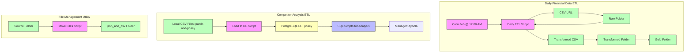

# ETL Architecture Diagram

```mermaid

graph TD

%% === STYLE DEFINITIONS ===
classDef bash fill:#f9f,stroke:#333,stroke-width:1px;
classDef sql fill:#bbf,stroke:#333,stroke-width:1px;
classDef data fill:#bfb,stroke:#333,stroke-width:1px;
classDef db fill:#ffb,stroke:#333,stroke-width:1px;

%% === DAILY FINANCIAL DATA ETL ===
subgraph daily_etl[Daily Financial Data ETL]
    cronjob[Cron Job @ 12:00 AM]:::bash --> daily_script[Daily ETL Script]:::bash
    daily_script --> csv_url[CSV URL]:::data
    csv_url --> raw_folder[Raw Folder]:::data
    raw_folder --> daily_script
    daily_script --> transformed_csv[Transformed CSV]:::data
    transformed_csv --> transformed_folder[Transformed Folder]:::data
    transformed_folder --> gold_folder[Gold Folder]:::data
end

%% === COMPETITOR ANALYSIS ETL ===
subgraph competitor_etl[Competitor Analysis ETL]
    local_csv[Local CSV Files: parch-and-posey]:::data --> posey_script[Load to DB Script]:::bash
    posey_script --> postgres_db[PostgreSQL DB: posey]:::db
    postgres_db --> sql_scripts[SQL Scripts for Analysis]:::sql
    sql_scripts --> manager[Manager: Ayoola]
end

%% === FILE MANAGEMENT UTILITY ===
subgraph file_mgmt[File Management Utility]
    source_folder[Source Folder]:::data --> move_script[Move Files Script]:::bash
    move_script --> json_csv_folder[json_and_csv Folder]:::data
end

```